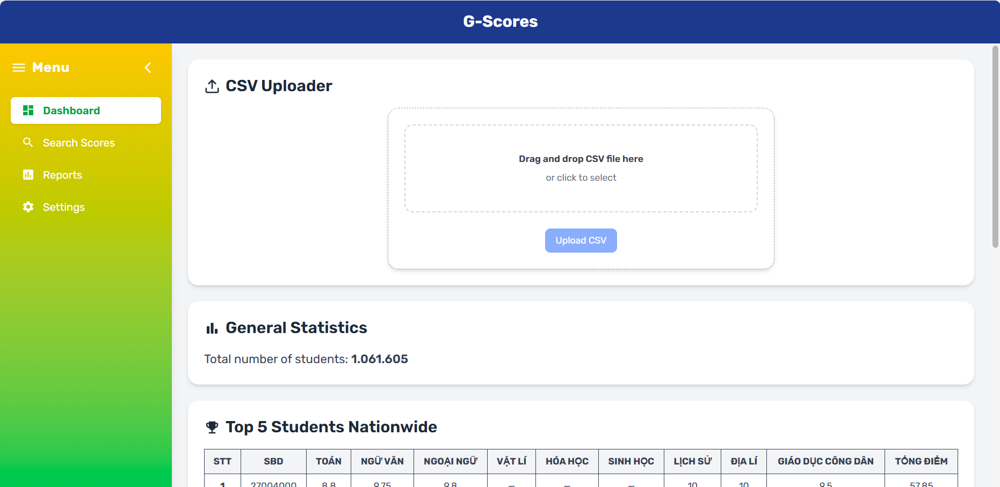
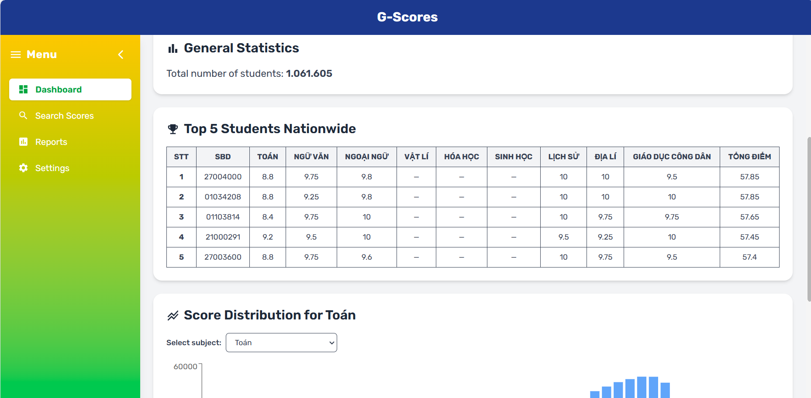
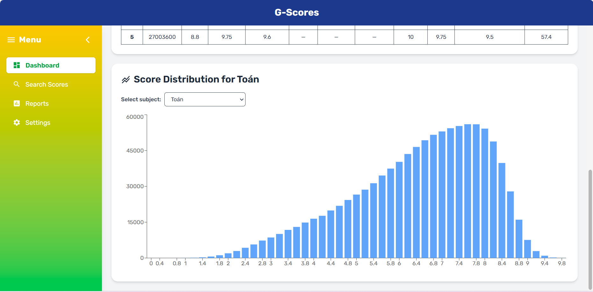
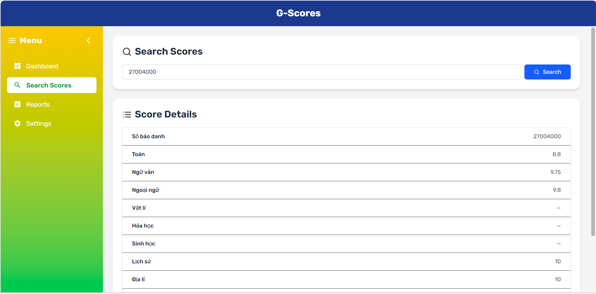
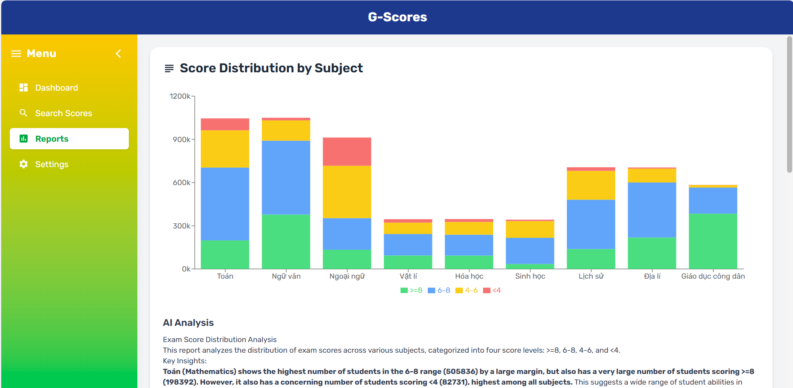
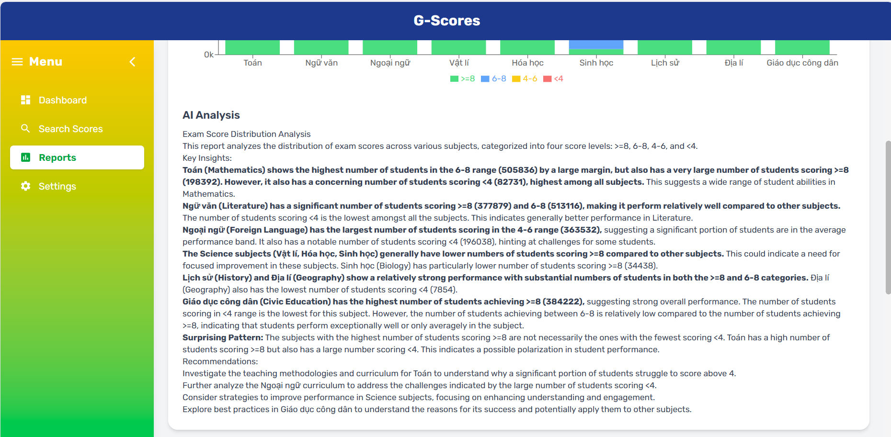
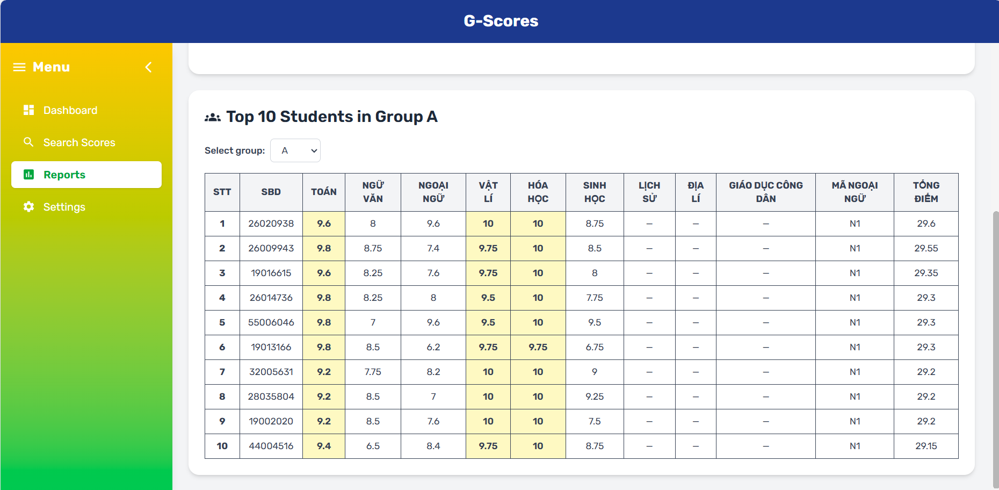

# G-Scores
## Tech Stack

- **Frontend**: React + Vite + TailwindCSS  
- **Backend**: Django + Django REST Framework  
- **Database**: PostgreSQL  
- **Dev Tools**: Docker + Docker Compose  

## Deployment
- Backend: https://g-scores-6.onrender.com
- Frontend: https://g-scores-iyke.vercel.app

## Environment Variables
```env
POSTGRES_DB=diem_thi
POSTGRES_USER=postgres
POSTGRES_PASSWORD=postgres
DB_HOST=db
DB_PORT=5432
ALLOWED_HOSTS = *
```
## Run Backend
```
cd backend
```
### 1. Build & Start All Services
```
docker-compose up --build
```
### 2. Apply Django Migrations
```
docker-compose exec backend python manage.py migrate
```
### 3. (Optional) Create Django Superuser
```
docker-compose exec backend python manage.py createsuperuser
```
### Notes
- Stop service: Ctrl + C then docker-compose down
- Unmount volume (reset database): docker-compose down -v
- Rebuild everything: docker-compose up --build

## Run Frontend
```
cd frontend
```
### 1. Environment Variables
```
VITE_API_BASE_URL=http://localhost:8000
```
### 2. Install dependencies
```
npm install
```
### 3. Run development server
```
npm run dev
```
## Development Details
- Backend : http://localhost:8000
- Frontend : http://localhost:5173

## Features Overview

### CSV Uploader

Upload a `.csv` file containing student exam scores to update the system's data.



---

### General Statistics

Display the total number of students in the system.

---

### Top 5 Students Nationwide

Showcase the top 5 students with the highest total scores across the country.



---

### Score Distribution by Subject

Select a subject (e.g., **Toán**, **Lý**, **Văn**, ...) to view a chart showing how many students scored each possible point.

- Full score frequency chart (e.g., 7.0 → 120 students)
- Supports foreign languages by code (N1–N7)
- Filters out missing scores



---

### Search Scores by Registration Number

Enter a student's registration number (`sbd`) to view their detailed exam scores.



---

### Score Report by Subject

Visualize the number of students in each score level by subject using charts. Useful for deeper insights and data analysis.

- Automatic breakdown into 4 score levels:
  - **≥ 8 points**
  - **6–8 points**
  - **4–6 points**
  - **< 4 points**
- Works per subject (e.g., Toán, Văn, Hóa...) 
- Interactive chart rendering and subject selection



#### AI Analysis

Get automatic insights from the score distribution using AI (Google Gemini). The system analyzes trends and outputs a summary in structured HTML.




### Top 10 Students by Subject Group

Select a subject group (e.g., **A**, **A1**, **B**, **C**, **D**...) to display the top 10 students with the highest scores in that group.


